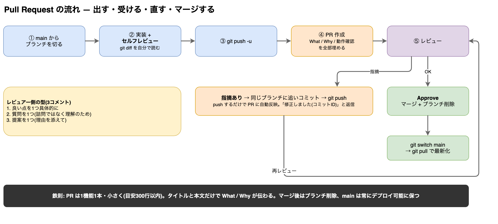

# 課題08: PR を出す

**ゴール:** 「ブランチ → 変更 → push → Pull Request 作成 → レビュー対応 → マージ」の一連の流れを、実際に GitHub 上で1回完走する。

**進め方は2通り。研修で権限をもらっている場合は A、そうでなければ B(フォーク)で進めます。**



> 図の原本は [docs/pr-flow.drawio](docs/pr-flow.drawio)([draw.io](https://app.diagrams.net) で編集可)

---

## 0. リポジトリを手元に用意する

### A. このリポジトリに push 権限がある場合

```bash
git clone <このリポジトリのURL>
cd angular-training-08-pull-request
npm install
```

### B. 権限がない場合(フォーク)

1. GitHub でこのリポジトリのページを開き、右上の **Fork** ボタンを押します。
2. 自分のアカウントにできたフォークを clone します。

```bash
git clone <自分のフォークのURL>
cd angular-training-08-pull-request
npm install
```

## 1. 課題内容を確認する

今回の変更内容(そのまま使います):

> **フッターにデータ出典(PokeAPI)の表記を追加する。** 理由: 画像・データの出典明記が推奨されているため。

`npx ng serve` でアプリを起動し、**現在はフッターが無い**ことをブラウザで確認しておきます。

## 2. ブランチを切る

```bash
git status                     # clean を確認
git switch -c feature/add-credit-footer
```

> ブランチ名は「何をするブランチか」が分かる名前にします。`fix-bug` や `work` は避けます。

## 3. 変更を実装する

1. `src/app/app.html` の**末尾**に、次をコピペして保存します。

   ```html
   <footer class="footer">
     <p>
       データ・画像:
       <a href="https://pokeapi.co" target="_blank" rel="noopener">PokeAPI</a>
     </p>
   </footer>
   ```

2. `src/app/app.css` の**末尾**に、次をコピペして保存します。

   ```css
   .footer {
     padding: 24px 20px;
     text-align: center;
     font-size: 12px;
     color: #7c828a;
   }

   .footer a {
     color: #e3350d;
   }
   ```

3. ブラウザで、ページ下部にフッターが表示されることを確認します。

## 4. セルフレビューしてからコミットする

1. **PR を出す前に、自分が最初のレビュアーになります。**

   ```bash
   git diff
   ```

   確認する観点: 関係ないファイルを触っていないか / 消し忘れの console.log やコメントがないか / インデントが揃っているか。
2. 問題なければコミットします。

   ```bash
   git add src/app/app.html src/app/app.css
   git commit -m "feat: フッターにデータ出典(PokeAPI)の表記を追加"
   ```

## 5. push する

```bash
git push -u origin feature/add-credit-footer
```

> `-u` を付けると、次回から `git push` だけで済むようになります。

## 6. Pull Request を作成する

### GitHub の画面で作る場合

1. ブラウザでリポジトリ(B の場合はフォーク元)のページを開きます。
2. 黄色い帯 **「Compare & pull request」** ボタンが出ているので押します(出ていない場合: **Pull requests タブ → New pull request** → compare に自分のブランチを選択)。
3. タイトルはコミットメッセージと同じでOK: `feat: フッターにデータ出典(PokeAPI)の表記を追加`
4. 本文にはテンプレート(`.github/PULL_REQUEST_TEMPLATE.md`)が自動で入ります。**すべての欄を埋めます:**
   - What: フッターに PokeAPI への出典表記とリンクを追加した
   - Why: データ・画像の出典明記が推奨されているため
   - 動作確認: チェックボックスを実際に確認してからチェック
   - スクリーンショット: フッター部分を撮って貼る(macOS: ⇧⌘4)
5. **Create pull request** を押します。

### CLI で作る場合(gh コマンドがある人向け)

```bash
gh pr create --title "feat: フッターにデータ出典(PokeAPI)の表記を追加" --web
```

(`--web` でブラウザが開き、テンプレートを埋めて提出できます)

## 7. レビューコメントに対応する

研修ではレビュアー(講師またはペアの受講者)がコメントを付けます。典型例:

> 「`target="_blank"` のリンクであることが見た目で分からないので、リンク後ろに ↗ を付けてください」

対応の手順:

1. **同じブランチのまま**修正します(`app.html` のリンク文言を `PokeAPI ↗` に変更して保存)。
2. ブラウザで確認 → コミット → push します。

   ```bash
   git add src/app/app.html
   git commit -m "fix: 外部リンクであることが分かるよう ↗ を追加"
   git push
   ```

3. **push するだけで PR に自動で反映されます。** PR 画面をリロードしてコミットが増えていることを確認します。
4. コメント欄に「修正しました」と返信し、指摘してくれた人に **Resolve** してもらいます。

## 8. マージする

1. レビュアーの **Approve** が付いたら、PR 画面の **Merge pull request → Confirm merge** を押します。
2. **Delete branch** ボタンでリモートブランチを削除します(マージ済みブランチは残さない)。
3. 手元も最新にします。

   ```bash
   git switch main
   git pull
   git branch -d feature/add-credit-footer
   ```

4. `git log --oneline` で自分の変更が main に入っていることを確認します。**これで1周完走です。**

---

## チェックリスト

- [ ] PR のタイトルと本文だけで「何を・なぜ」が伝わる
- [ ] push の前に `git diff` でセルフレビューした
- [ ] レビュー指摘に「同じブランチへの追いコミット」で対応した
- [ ] マージ後にブランチを削除し、手元の main を最新化した

---

## 1日の流れ(7時間の目安)

| 時間 | 内容 |
|---|---|
| 午前(2〜3h) | この手順書(README)を完走する |
| 午後(3〜4h) | [練習課題(EXERCISES.md)](./EXERCISES.md) に取り組む |
| 最後(30分) | EXERCISES.md 末尾の「1日の終わりに」でふりかえる |

回答例は [ANSWERS.md](./ANSWERS.md) にあります。**練習課題はまず自力で30分粘ってから**見ること。
